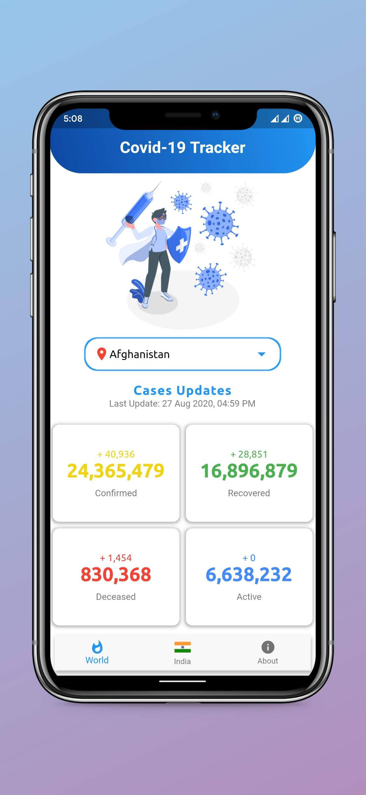
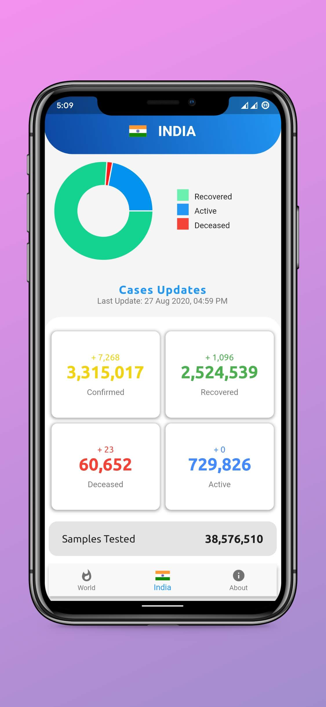
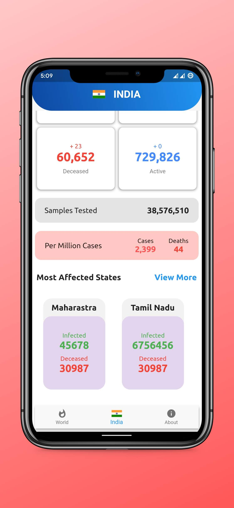
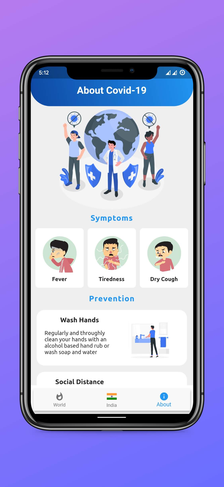

# Covid19 Flutter App

**Screenshot**

**Requirements**
- Location Access
- Internet connection
- Storage requirement < 30mb

**Highlights**
- Use [Covid19] API
- Beautiful Ui across screens
- Cross Platform
- Indian States data
- All time data for every countries

**Author**
 
<a href="https://github.com/vineetk242000" style="text-decoration:none">Vineet Kumar</a>
